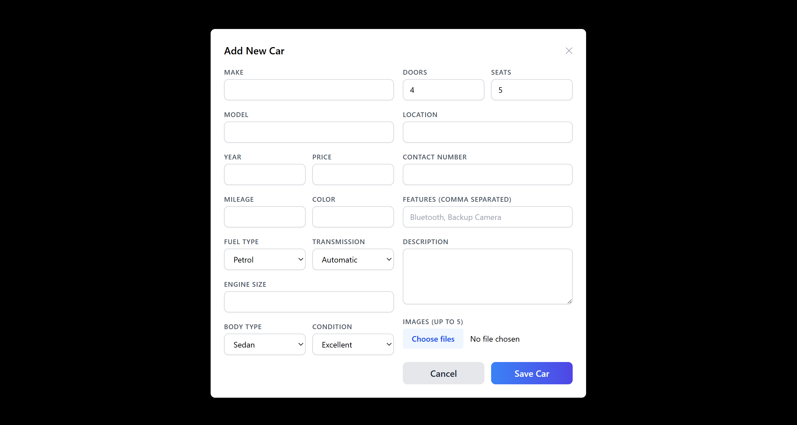
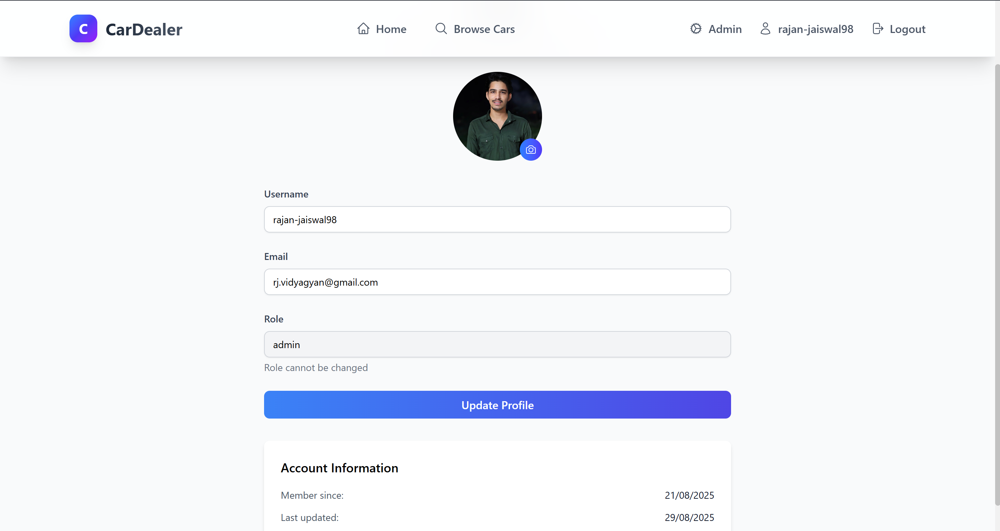

# Car Dealer Platform

Full-stack car dealership platform with user authentication, email verification (OTP), password reset, role-based admin panel, and Cloudinary-backed image management.

## Live Demo
- Frontend: https://cardealer-frontend-fyyz.onrender.com
- Backend API: https://cardealer-backend-iu7l.onrender.com/api/health


## Screenshots / UI Preview

| Feature | Screenshot |
|---------|------------|
| Home / Listing |  |
| Car Detail |  |
| Register / Verify Email |  |
| Login |  |
| Admin Panel (Cars) |  |
| Admin Panel (Users) |  |
| Add Car Modal |  |
| Profile |  |
| Car Listing with Pagination |  |


## Tech Stack
### Frontend
- React 19 + Vite
- React Router
- Tailwind CSS utilities (custom classes in `client/src/index.css`)
- Axios (with credentials)
- Heroicons

### Backend
- Node.js / Express 5
- MongoDB + Mongoose 8
- JWT auth (httpOnly cookies + Authorization header support)
- Cloudinary (image hosting)
- Multer (temp storage only, files deleted after Cloudinary upload)
- Nodemailer (Brevo SMTP relay) for OTP & password reset
- Helmet, CORS (dynamic allow-list), rate limiting, security middlewares

## Key Features
- User registration with email verification (OTP)
- Secure login + httpOnly cookie token storage
- Password reset via OTP email
- Role-based access: admin vs standard user
- Admin Panel: create/delete cars, manage users, promote/demote admins (with safeguard for last admin)
- Car listing & detail pages using Cloudinary image URLs only
- Profile management & timestamps (createdAt / updatedAt surfaced)
- Centralized environment configuration (`server/src/config/env.js`)

## Project Structure (Top-Level)
```
client/           # React frontend
server/           # Express API
README.md         # This file
```

Notable backend folders:
```
server/src/controllers
server/src/middlewares
server/src/models
server/src/routes
server/src/utils
server/src/config/env.js
```

## Environment Variables
Create `.env` files in `server/` and optionally in `client/` (for Vite: prefix with VITE_). Example server `.env`:
```
PORT=your_port
NODE_ENV=development/production
MONGODB_URI=your_production_mongodb_connection
JWT_SECRET=change_me_in_production
SMTP_USER=your_brevo_user
SMTP_PASS=your_brevo_pass
SENDER_EMAIL=car-dealer@example.com
CLOUDINARY_CLOUD_NAME=your_cloud_name
CLOUDINARY_API_KEY=your_api_key
CLOUDINARY_API_SECRET=your_api_secret
CORS_ORIGINS=your_frontend_origin
```
`config/env.js` loads these once and exports typed constants. In development a fallback JWT secret is provided with a warning if not set.

## Local Development
### 1. Install Dependencies
From both `client` and `server` folders:
```
npm install
```

### 2. Run Dev Servers (two terminals)
Client (Vite default 5173) and Server (e.g., 5000):
```
# In client/
npm run dev

# In server/
npm run dev
```

### 3. Access App
Visit: https://cardealer-frontend-fyyz.onrender.com

### 4. Creating an Admin
Register a user, then manually update its role in MongoDB (first admin), after that you can promote/demote through the Admin Panel endpoints.

## API Overview (Selected)
| Method | Endpoint | Description |
|--------|----------|-------------|
| POST | /api/users/register | Register + send verification OTP |
| POST | /api/users/login | Login, sets cookie |
| POST | /api/users/verify-email | Verify OTP |
| POST | /api/users/forgot-password | Request password reset OTP |
| POST | /api/users/reset-password | Reset password with OTP |
| GET | /api/users/profile | Get current user profile |
| GET | /api/users/admin/status/summary | Admin stats summary |
| POST | /api/users/admin/promote/:id | Promote user to admin |
| POST | /api/users/admin/demote/:id | Demote admin (safeguards) |
| GET | /api/cars | List cars |
| GET | /api/cars/:id | Car detail |
| POST | /api/cars | Create car (admin, multipart) |
| DELETE | /api/cars/:id | Delete car (admin) |

## Image Handling
- Images uploaded via Add Car modal (multipart/form-data)
- Saved to temp disk via Multer then immediately uploaded to Cloudinary
- Temp files removed after upload completion (or failure cleanup)
- Client consumes Cloudinary URLs directly; no local /uploads serving

## Security & Hardening
- CORS: dynamic origin validation (development defaults + env list)
- Helmet with CSP updated to allow Cloudinary assets
- Rate limiting middleware for brute-force mitigation
- Centralized error handler with Multer-specific handling
- Admin safeguard: cannot delete/demote last remaining admin

## Logging
- Development: concise console logs (uploads, env fallbacks)
- Production: minimal noise; avoid leaking secrets


## 📄 License

This project is licensed under the MIT License.

---

## 💬 Contact

📧 Email: rj.vidyagyan@gmail.com
Feel free to reach out for feedback