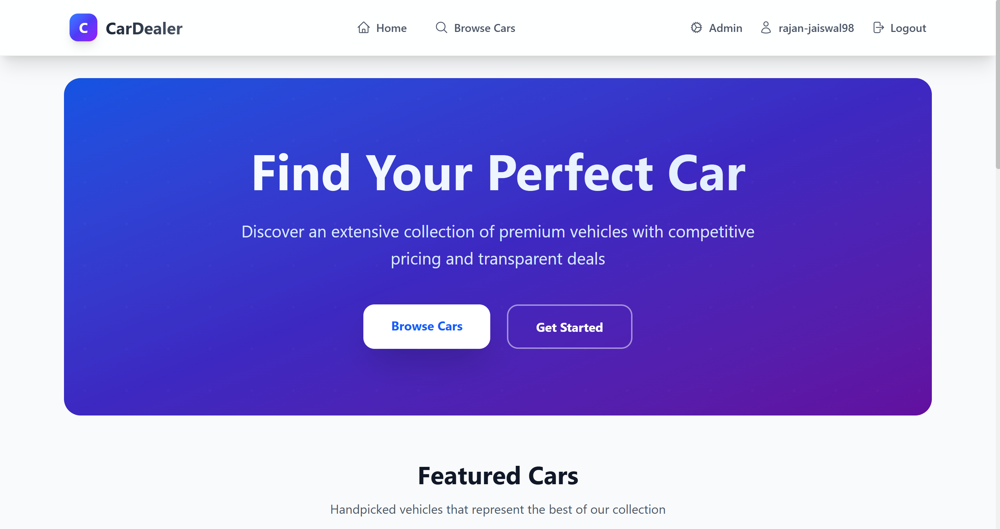
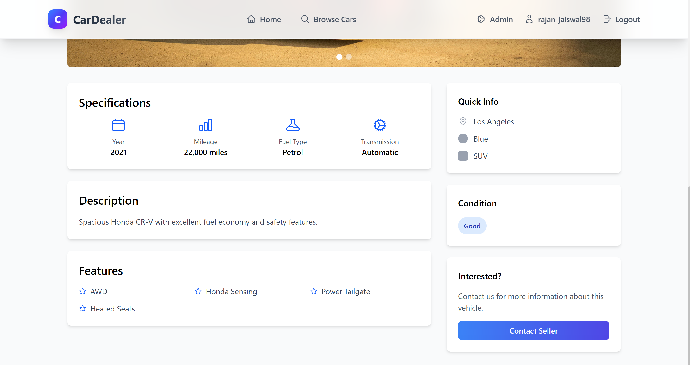

# CarDekho - Buy & Sell Certified Used Cars

[**Live Demo**](https://car-dekho-iota.vercel.app/)

> **Your trusted partner for buying and selling quality pre-owned vehicles with transparency and ease.**

CarDekho is a full-stack web application designed to simplify the car buying and selling process. It features a modern, responsive user interface, secure authentication with email verification, and a comprehensive admin panel for managing inventory and users. Whether you're looking for your next dream car or selling your current one, CarDekho provides a seamless experience.

---

## 📖 Table of Contents

- [What Does It Do?](#what-does-it-do)
- [Key Features](#key-features)
- [Tech Stack](#tech-stack)
- [How It Works Under the Hood](#how-it-works-under-the-hood)
- [Project Structure](#project-structure)
- [Getting Started](#getting-started)
- [Environment Variables](#environment-variables)
- [Benefits](#benefits)
- [License](#license)

---

## <a id="what-does-it-do"></a>🎯 What Does It Do?



CarDekho bridges the gap between car sellers and buyers by providing a secure and intuitive platform.

Instead of navigating through unverified listings or dealing with complex paperwork alone, you can:

1.  **Browse Certified Listings**: Filter cars by make, model, price, and condition.
2.  **Sell Your Car**: Easily upload car details and images to reach potential buyers.
3.  **Secure Interactions**: All users are verified via email OTP to ensure genuine interactions.
4.  **Manage Inventory**: Admins have full control over listings and user management to maintain platform quality.

---

## <a id="key-features"></a>✨ Key Features

### 🔐 Authentication & Security
- **Secure Sign-Up**: User registration with **OTP email verification** (via Brevo).
- **Password Safety**: Forgot-password flow with OTP verification.
- **Session Management**: **JWT-based authentication** stored in httpOnly cookies for maximum security.
- **Role-Based Access**: Specialized dashboards for **Admins** vs. **Clients**.

### 🚗 Car Management

- **Advanced Search**: Full-text search across make, model, and description.
- **Smart Filters**: Filter by price range, body type, fuel type, and condition.
- **Rich Media**: High-quality image galleries for every vehicle (powered by Cloudinary).
- **Detailed Specs**: Comprehensive vehicle specifications at a glance.

### 🛠 Admin Panel

- **Dashboard Stats**: Real-time overview of total users, cars, and inventory value.
- **User Management**: View and remove users (with safeguards for admin accounts).
- **Inventory Control**: Create, update, or remove car listings directly.

### 👤 User Profile
- **Personalized Space**: Update your profile details and profile picture.
- **Verification Status**: Visual indicators for verified accounts.

### 🎨 Modern UI / UX
- **Responsive Design**: Mobile-first architecture using **Tailwind CSS 4**.
- **Smooth Animations**: Page transitions and interactive elements powered by **Framer Motion**.
- **Dark Theme**: Sleek, professional aesthetic with a custom charcoal and slate palette.

---

## <a id="tech-stack"></a>🛠 Tech Stack

| Layer | Technology | Purpose |
|-------|-----------|---------|
| **Frontend Framework** | React 19 | Component-based UI architecture |
| **Build Tool** | Vite 7 | Lightning-fast development and build bundling |
| **Styling** | Tailwind CSS 4 | Utility-first styling with custom theme config |
| **Animations** | Framer Motion | Complex UI transitions and micro-interactions |
| **Backend Runtime** | Node.js | Scalable server-side JavaScript environment |
| **API Framework** | Express 5 | RESTful API routing and middleware management |
| **Database** | MongoDB + Mongoose 8 | NoSQL database for flexible data modeling |
| **Authentication** | JWT + bcryptjs | Stateless, secure authentication |
| **Image Storage** | Cloudinary | Cloud-based image optimization and delivery |
| **Email Service** | Nodemailer + Brevo | Reliable transactional email delivery (OTP) |

---

## <a id="how-it-works-under-the-hood"></a>⚙️ How It Works Under the Hood

### 1. Authentication Flow
```
User Registers
    ↓
Server generates 6-digit OTP & hashes password
    ↓
OTP sent via Email (Brevo)
    ↓
User enters OTP → Account Verified
    ↓
Login → Server issues JWT (httpOnly cookie)
```

### 2. Image Upload Pipeline
```
User uploads images (Frontend)
    ↓
Request sent to Server (multipart/form-data)
    ↓
Multer middleware saves to temp disk
    ↓
Cloudinary utility uploads file -> Gets URL
    ↓
Temp file deleted from disk
    ↓
Cloudinary URL saved to MongoDB
```

---

## <a id="project-structure"></a>📁 Project Structure

```
CarDekho/
├── client/                         # React Frontend
│   ├── src/
│   │   ├── components/             # Reusable UI (Navbar, Cards, Modals)
│   │   ├── pages/                  # Page Views (Home, Listing, Admin)
│   │   ├── context/                # Global State (Auth)
│   │   └── ...
│   └── ...
│
├── server/                         # Express Backend
│   ├── src/
│   │   ├── controllers/            # Route Logic
│   │   ├── models/                 # Mongoose Schemas (User, Car)
│   │   ├── routes/                 # API Endpoints
│   │   ├── utils/                  # Helpers (Cloudinary, Email)
│   │   └── ...
│   └── ...
│
└── README.md                       # Documentation
```

---

## <a id="getting-started"></a>🚀 Getting Started

### Prerequisites
- **Node.js** (v18+)
- **MongoDB** (Local or Atlas)
- **Cloudinary Account**
- **Brevo Account** (for SMTP)

### 1. Clone the Repository
```bash
git clone https://github.com/<your-username>/CarDekho.git
cd CarDekho
```

### 2. Install Dependencies
```bash
# Install Server Deps
cd server && npm install

# Install Client Deps
cd ../client && npm install
```

### 3. Run Application
Open two terminals:

**Terminal 1 (Backend)**
```bash
cd server
npm run dev
```

**Terminal 2 (Frontend)**
```bash
cd client
npm run dev
```

Visit **http://localhost:5173** to view the app.

---

## <a id="environment-variables"></a>🌍 Environment Variables

Create `.env` files in `server/` and `client/`:

**Server (`server/.env`)**
```env
PORT=5000
MONGODB_URI=mongodb+srv://...
JWT_SECRET=your_secret
CLOUDINARY_CLOUD_NAME=...
CLOUDINARY_API_KEY=...
CLOUDINARY_API_SECRET=...
SMTP_USER=...
SMTP_PASS=...
FRONTEND_ORIGIN=http://localhost:5173
```

**Client (`client/.env`)**
```env
VITE_API_BASE_URL=http://localhost:5000
```

---

## <a id="benefits"></a>🌟 Benefits

-   **Transparency**: Detailed listings and verified users build trust.
-   **Security**: Robust data protection and secure authentication flows.
-   **Performance**: Optimized assets and fast response times.
-   **Scalability**: Built on a MERN stack designed to grow.

---

## <a id="license"></a>📜 License

This project is licensed under the **MIT License**. See the [LICENSE](LICENSE) file for details.

---

## � Acknowledgments

-   **Cloudinary** — For seamless image management.
-   **Brevo** — For reliable email delivery services.
-   **Tailwind CSS** — For the rapid UI development framework.